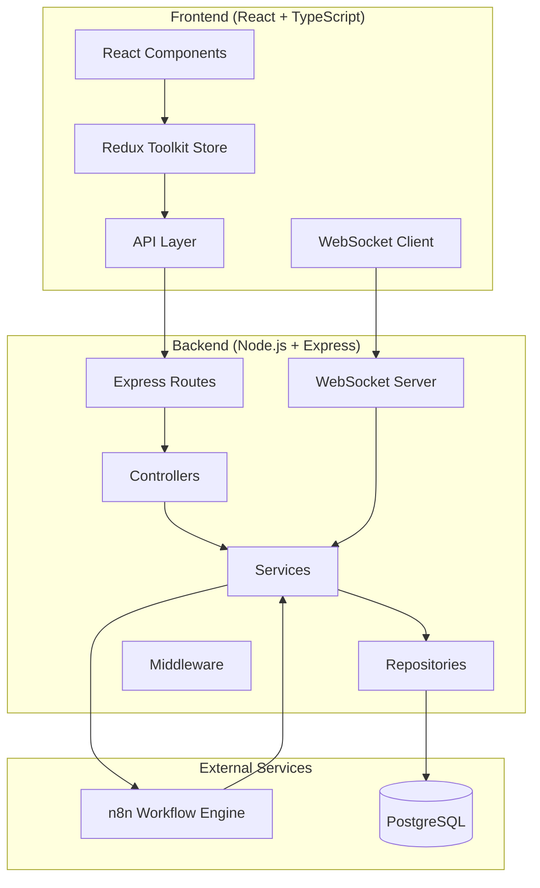

# Design Document

## Overview

The Workflow-Driven Task Automation Platform is a full-stack application that enables users to create, manage, and execute automation workflows through a modern web interface. The system integrates with n8n for workflow execution, provides real-time updates via WebSockets, and maintains comprehensive execution history.

### Architecture Goals
- **Modularity**: Clear separation of concerns with layered architecture
- **Scalability**: Designed to handle growing user base and workflow complexity
- **Maintainability**: Clean code patterns and comprehensive testing
- **Portfolio-Ready**: Enterprise-grade patterns suitable for job applications
- **Cloud-Ready**: Easy transition from local development to production deployment

## Architecture

### System Architecture Diagram



### Technology Stack

**Frontend:**
- React 18 with TypeScript
- Redux Toolkit for state management
- React Router v6 for routing
- Socket.IO client for real-time updates
- Tailwind CSS for styling
- React Hook Form for form management
- React Query for server state management

**Backend:**
- Node.js with Express and TypeScript
- Prisma ORM with PostgreSQL
- Socket.IO for WebSocket communication
- JWT authentication with refresh tokens
- Zod for input validation
- Winston for logging
- Jest for testing

**Infrastructure:**
- Docker Compose for local development
- n8n for workflow execution
- PostgreSQL database
- Redis for session storage (optional)

## Components and Interfaces

### Frontend Architecture

#### Component Structure
```
client/
├── src/
│   ├── components/          # Reusable UI components
│   │   ├── common/         # Generic components (Button, Modal, etc.)
│   │   ├── forms/          # Form-specific components
│   │   └── layout/         # Layout components (Header, Sidebar)
│   ├── features/           # Feature-based modules
│   │   ├── auth/           # Authentication components & logic
│   │   ├── workflows/      # Workflow management
│   │   ├── executions/     # Execution monitoring
│   │   └── dashboard/      # Dashboard & analytics
│   ├── hooks/              # Custom React hooks
│   ├── services/           # API service layer
│   ├── store/              # Redux store configuration
│   ├── types/              # TypeScript type definitions
│   └── utils/              # Utility functions
```

#### Key Frontend Interfaces

```typescript
// Workflow Types
interface Workflow {
  id: string;
  name: string;
  description: string;
  definition: WorkflowDefinition;
  status: 'active' | 'inactive' | 'draft';
  createdAt: Date;
  updatedAt: Date;
  userId: string;
}

interface WorkflowDefinition {
  nodes: WorkflowNode[];
  connections: WorkflowConnection[];
  settings: WorkflowSettings;
}

// Execution Types
interface Execution {
  id: string;
  workflowId: string;
  status: 'pending' | 'running' | 'success' | 'failed';
  startedAt: Date;
  finishedAt?: Date;
  inputData: Record<string, any>;
  outputData?: Record<string, any>;
  errorMessage?: string;
}

// WebSocket Events
interface WebSocketEvents {
  'execution:started': { executionId: string; workflowId: string };
  'execution:progress': { executionId: string; progress: number };
  'execution:completed': { executionId: string; status: string; result: any };
  'execution:failed': { executionId: string; error: string };
}
```

### Backend Architecture

#### Layered Architecture
```
server/
├── src/
│   ├── controllers/        # HTTP request handlers
│   ├── services/           # Business logic layer
│   ├── repositories/       # Data access layer
│   ├── middleware/         # Express middleware
│   ├── routes/             # Route definitions
│   ├── types/              # TypeScript interfaces
│   ├── utils/              # Utility functions
│   ├── config/             # Configuration files
│   └── websocket/          # WebSocket handlers
```

#### Key Backend Interfaces

```typescript
// Service Interfaces
interface WorkflowService {
  createWorkflow(userId: string, data: CreateWorkflowDto): Promise<Workflow>;
  updateWorkflow(id: string, data: UpdateWorkflowDto): Promise<Workflow>;
  deleteWorkflow(id: string): Promise<void>;
  getUserWorkflows(userId: string): Promise<Workflow[]>;
  executeWorkflow(id: string, inputData?: any): Promise<Execution>;
}

interface ExecutionService {
  createExecution(workflowId: string, inputData: any): Promise<Execution>;
  updateExecutionStatus(id: string, status: ExecutionStatus, result?: any): Promise<void>;
  getExecutionHistory(workflowId: string, pagination: PaginationDto): Promise<PaginatedResult<Execution>>;
}

// Repository Interfaces
interface WorkflowRepository {
  create(data: CreateWorkflowData): Promise<Workflow>;
  findById(id: string): Promise<Workflow | null>;
  findByUserId(userId: string): Promise<Workflow[]>;
  update(id: string, data: UpdateWorkflowData): Promise<Workflow>;
  delete(id: string): Promise<void>;
}

// n8n Integration
interface N8nService {
  executeWorkflow(workflowDefinition: WorkflowDefinition, inputData: any): Promise<N8nExecutionResult>;
  getExecutionStatus(executionId: string): Promise<N8nExecutionStatus>;
  createWebhook(workflowId: string): Promise<string>;
}
```

## Data Models

### Database Schema (Prisma)

```prisma
model User {
  id        String   @id @default(cuid())
  email     String   @unique
  password  String
  name      String?
  createdAt DateTime @default(now())
  updatedAt DateTime @updatedAt
  
  workflows  Workflow[]
  executions Execution[]
  refreshTokens RefreshToken[]
  
  @@map("users")
}

model Workflow {
  id          String   @id @default(cuid())
  name        String
  description String?
  definition  Json
  status      WorkflowStatus @default(DRAFT)
  createdAt   DateTime @default(now())
  updatedAt   DateTime @updatedAt
  
  userId      String
  user        User @relation(fields: [userId], references: [id], onDelete: Cascade)
  
  executions  Execution[]
  
  @@map("workflows")
}

model Execution {
  id          String   @id @default(cuid())
  status      ExecutionStatus @default(PENDING)
  startedAt   DateTime @default(now())
  finishedAt  DateTime?
  inputData   Json?
  outputData  Json?
  errorMessage String?
  n8nExecutionId String?
  
  workflowId  String
  workflow    Workflow @relation(fields: [workflowId], references: [id], onDelete: Cascade)
  
  userId      String
  user        User @relation(fields: [userId], references: [id], onDelete: Cascade)
  
  @@map("executions")
}

model RefreshToken {
  id        String   @id @default(cuid())
  token     String   @unique
  expiresAt DateTime
  createdAt DateTime @default(now())
  
  userId    String
  user      User @relation(fields: [userId], references: [id], onDelete: Cascade)
  
  @@map("refresh_tokens")
}

enum WorkflowStatus {
  DRAFT
  ACTIVE
  INACTIVE
}

enum ExecutionStatus {
  PENDING
  RUNNING
  SUCCESS
  FAILED
  CANCELLED
}
```

### API Response Models

```typescript
// Standard API Response
interface ApiResponse<T = any> {
  success: boolean;
  data?: T;
  error?: {
    message: string;
    code: string;
    details?: any;
  };
  meta?: {
    pagination?: PaginationMeta;
    timestamp: string;
  };
}

// Pagination
interface PaginationMeta {
  page: number;
  limit: number;
  total: number;
  totalPages: number;
}

interface PaginatedResult<T> {
  items: T[];
  meta: PaginationMeta;
}
```

## Error Handling

### Error Classification

```typescript
enum ErrorCode {
  // Authentication
  UNAUTHORIZED = 'UNAUTHORIZED',
  FORBIDDEN = 'FORBIDDEN',
  TOKEN_EXPIRED = 'TOKEN_EXPIRED',
  
  // Validation
  VALIDATION_ERROR = 'VALIDATION_ERROR',
  INVALID_INPUT = 'INVALID_INPUT',
  
  // Business Logic
  WORKFLOW_NOT_FOUND = 'WORKFLOW_NOT_FOUND',
  EXECUTION_FAILED = 'EXECUTION_FAILED',
  N8N_UNAVAILABLE = 'N8N_UNAVAILABLE',
  
  // System
  INTERNAL_ERROR = 'INTERNAL_ERROR',
  DATABASE_ERROR = 'DATABASE_ERROR',
}

class AppError extends Error {
  constructor(
    public code: ErrorCode,
    public message: string,
    public statusCode: number = 500,
    public details?: any
  ) {
    super(message);
  }
}
```

### Error Handling Middleware

```typescript
const errorHandler = (error: Error, req: Request, res: Response, next: NextFunction) => {
  if (error instanceof AppError) {
    return res.status(error.statusCode).json({
      success: false,
      error: {
        code: error.code,
        message: error.message,
        details: error.details
      }
    });
  }
  
  // Log unexpected errors
  logger.error('Unexpected error:', error);
  
  return res.status(500).json({
    success: false,
    error: {
      code: ErrorCode.INTERNAL_ERROR,
      message: 'An unexpected error occurred'
    }
  });
};
```

## Testing Strategy

### Backend Testing

**Unit Tests:**
- Service layer business logic
- Utility functions
- Middleware functions
- Repository methods

**Integration Tests:**
- API endpoints with database
- n8n service integration
- WebSocket functionality
- Authentication flows

**Test Structure:**
```typescript
describe('WorkflowService', () => {
  describe('createWorkflow', () => {
    it('should create workflow with valid data', async () => {
      // Test implementation
    });
    
    it('should throw validation error for invalid data', async () => {
      // Test implementation
    });
  });
});
```

### Frontend Testing

**Unit Tests:**
- Component rendering
- Custom hooks
- Utility functions
- Redux reducers

**Integration Tests:**
- API service calls
- Component interactions
- Form submissions
- WebSocket connections

**E2E Tests (Cypress):**
- Complete user workflows
- Authentication flows
- Workflow creation and execution
- Real-time updates

## Security Considerations

### Authentication & Authorization
- JWT access tokens (15-minute expiry)
- Refresh tokens (7-day expiry)
- Secure HTTP-only cookies for refresh tokens
- Role-based access control (future enhancement)

### Input Validation
- Zod schemas for all API inputs
- SQL injection prevention via Prisma
- XSS protection via helmet middleware
- CSRF protection for state-changing operations

### API Security
- Rate limiting (100 requests/minute per IP)
- CORS configuration for allowed origins
- Request size limits
- Sensitive data masking in logs

### n8n Integration Security
- API key authentication
- Webhook signature verification
- Input sanitization for workflow definitions
- Execution timeout limits

## Performance Considerations

### Database Optimization
- Proper indexing on frequently queried fields
- Connection pooling via Prisma
- Query optimization for execution history
- Archival strategy for old executions

### Caching Strategy
- Redis for session storage (optional)
- In-memory caching for workflow definitions
- API response caching for static data
- WebSocket connection management

### Frontend Performance
- Code splitting by routes
- Lazy loading of components
- Memoization of expensive calculations
- Virtual scrolling for large lists
- Optimistic updates for better UX

## Deployment Architecture

### Local Development
```yaml
# docker-compose.yml
version: '3.8'
services:
  postgres:
    image: postgres:15
    environment:
      POSTGRES_DB: workflow_platform
      POSTGRES_USER: dev
      POSTGRES_PASSWORD: dev
    ports:
      - "5432:5432"
  
  n8n:
    image: n8nio/n8n
    ports:
      - "5678:5678"
    environment:
      - N8N_BASIC_AUTH_ACTIVE=true
      - N8N_BASIC_AUTH_USER=admin
      - N8N_BASIC_AUTH_PASSWORD=admin
    volumes:
      - n8n_data:/home/node/.n8n
  
  redis:
    image: redis:7-alpine
    ports:
      - "6379:6379"

volumes:
  n8n_data:
```

### Production Considerations
- Container orchestration (Docker Swarm/Kubernetes)
- Load balancing for multiple backend instances
- Database clustering and replication
- CDN for static assets
- SSL/TLS termination
- Environment-specific configuration
- Health checks and monitoring
- Automated backups
- Log aggregation and monitoring